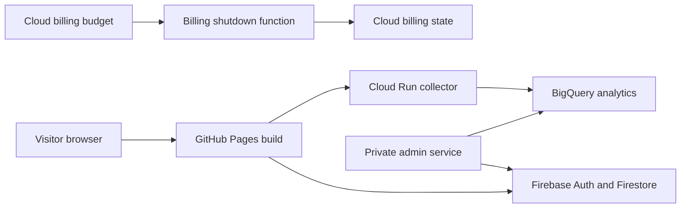

# Architecture Overview

GDG Tulsa is a static frontend hosted on GitHub Pages with Firebase-backed member features and separate Python services on Google Cloud Run and Cloud Functions.

The frontend source lives in `src/frontend`. `scripts/build.sh` creates the root-relative GitHub Pages artifact in `build/`.

## Request Flow

